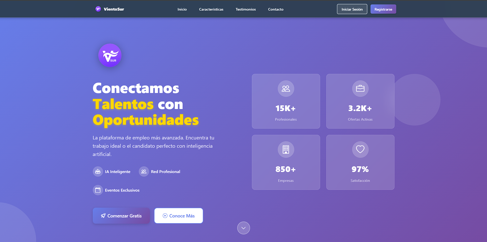

# 🌬️ VientoSur — AI-Powered Recruitment Platform

> **Full-Stack Job Matching Platform with Semantic AI Engine**
> Final Thesis Project | Computer Science Degree

---

## 🔗 Full Project Page

**→ [View full portfolio with screenshots and details](https://vientosur-portfolio.vercel.app)**

> If you're browsing this repo locally, open `index.html` directly in your browser.

---

## 🎯 What is this?

Enterprise-grade recruitment platform that uses **Cohere's multilingual NLP embeddings** to match candidates with job opportunities via semantic similarity — not keyword matching.

Built as a **final thesis project** for Computer Science degree.

> ⭐ The codebase is private (commercial academic work). This repo contains the **portfolio presentation** only.

---

## 🛠️ Tech Stack

| Layer     | Technologies |
|-----------|-------------|
| Frontend  | Angular 19, TypeScript 5.7, Bootstrap 5 + SCSS, RxJS |
| Backend   | Java 21, Spring Boot 3.2.4, Spring Security + JWT, Apache PDFBox |
| Database  | PostgreSQL 17 + pgvector (migration path for local vector storage) |
| AI        | Cohere Java SDK (multilingual embeddings, NLP) |
| DevOps    | Docker + Compose, Nginx, GitHub Actions |

---

## ✨ Key Features

- **AI Matching Engine** — Semantic similarity via Cohere API, 88% avg. compatibility on successful matches
- **Smart CV Parser** — PDF → structured data extraction with Apache PDFBox
- **AI Cover Letter Generator** — Auto-generated, tailored per job posting
- **Job Description Optimizer** — AI suggestions to attract better candidates
- **Real-Time Chat** — WebSocket-based recruiter-candidate messaging
- **VientoBot** — Career AI assistant for interview practice and CV feedback
- **Multi-Role Dashboards** — Candidates, Recruiters, Companies
- **Enterprise Security** — JWT auth, RBAC, signed URLs with expiration

---

## 📸 Screenshots

| Landing | Recruiter Dashboard |
|---------|-------------------|
|  |  |

| AI Job Editor | Candidate Dashboard |
|---------|-------------------|
|  |  |

---

## 📞 Contact

**Luca Zunino** — Computer Science Graduate · Full-Stack Developer Jr.
📧 lucazuninod@gmail.com
💼 [LinkedIn](https://www.linkedin.com/in/lucazuninod/)
