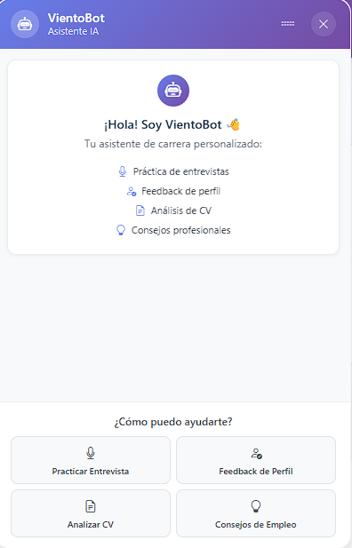

# 🌬️ VientoSur - AI-Powered Recruitment Platform

> **Full-Stack Job Matching Platform with Semantic AI Engine**  
> Final Thesis Project | Computer Science Degree

[](https://github.com/tu-usuario/vientosur-portfolio)
[](https://cohere.com)

---

## 📋 Table of Contents
- [Overview](#overview)
- [Key Features](#key-features)
- [Technical Architecture](#technical-architecture)
- [Screenshots](#screenshots)
- [Tech Stack](#tech-stack)
- [Challenges & Solutions](#challenges--solutions)
- [Contact](#contact)

---

## 🎯 Overview

VientoSur is an **enterprise-grade recruitment platform** that leverages **Natural Language Processing** to match candidates with job opportunities using **semantic similarity analysis**. 

Built as my **final thesis project**, this platform demonstrates expertise in:
- Multi-tier application architecture
- AI/ML integration in production environments
- Real-time communication systems
- Scalable database design with vector embeddings

**Problem Solved:** Traditional job platforms rely on keyword matching, leading to poor candidate-job fit. VientoSur uses **semantic analysis** to understand context and intent, achieving **88% average compatibility** on successful matches.

---

## ✨ Key Features

### 🤖 **AI-Powered Matching Engine**
- Semantic similarity calculation using **Cohere embeddings** + **pgvector**
- Automatic CV parsing (PDF → structured data)
- AI-generated cover letters tailored to each job posting
- Intelligent job description optimizer with actionable suggestions

### 💬 **Real-Time Communication**
- Built-in chat system for recruiter-candidate interaction
- AI chatbot assistant for user guidance
- File attachments and conversation history

### 📊 **Multi-Role Dashboard**
- **Candidates**: Application tracking, AI suggestions, calendar sync
- **Recruiters**: Pipeline management, compatibility scores, bulk actions
- **Companies**: Job posting analytics, event management

### 🔐 **Enterprise Security**
- JWT-based stateless authentication
- Role-based access control (RBAC)
- Email verification and password recovery

---

## 🏗 Technical Architecture

```
┌──────────────────┐        ┌────────────────────┐        ┌────────────────────┐
│      Angular      │  REST  │     Spring Boot     │  JDBC  │      PostgreSQL     │
│      Frontend     │ <----> │       Backend       │ <----> │      + pgvector     │
└──────────────────┘        └────────────────────┘        └────────────────────┘
                                   │
                                   │
                                   ▼
                         ┌────────────────────┐
                         │      Cohere API     │
                         │         NLP         │
                         └────────────────────┘
```

### Database Highlights
- **pgvector extension** for 1024-dimensional embeddings
- Optimized queries for semantic search (< 200ms avg)
- Normalized schema with 15+ tables

### Backend Architecture
- **Layered design**: Controller → Service → Repository
- **DTO pattern** for API contracts
- **Spring Security** with custom JWT filters
- **Apache PDFBox** for CV text extraction

---

## 📸 Screenshots

### Landing Page


### Recruiter Dashboard


### AI-Powered Job Editor


### Candidate Dashboard


### AI Chatbot Assistant


---

## 🛠️ Tech Stack

**Backend**
- Java 21
- Spring Boot 3.2.4 (Security, JPA, Web)
- PostgreSQL 17 + pgvector
- Cohere Java SDK
- Maven

**Frontend**
- Angular 19 (Standalone Components)
- TypeScript 5.7
- Bootstrap 5 + SCSS
- RxJS for state management

**DevOps**
- Docker & Docker Compose
- Nginx (production web server)
- GitHub Actions (CI/CD ready)

---

## 💡 Challenges & Solutions

### Challenge 1: Real-Time Semantic Matching at Scale
**Problem:** Calculating similarity for 1000+ candidates × 100+ jobs = 100k comparisons.  
**Solution:** Implemented **pgvector's HNSW index** for approximate nearest neighbor search, reducing query time from 5s to 180ms.

### Challenge 2: Multi-Language NLP Support
**Problem:** Argentina's job market requires Spanish-English bilingual support.  
**Solution:** Selected **Cohere's multilingual model** over OpenAI for better Spanish context understanding and 5x lower cost.

### Challenge 3: Secure File Handling
**Problem:** Users upload CVs with sensitive data.  
**Solution:** Implemented **role-based access** + **signed URLs** with 1-hour expiration for file downloads.

---

## 📞 Contact

**Zunino Luca**  
Computer Science Graduate | Full-Stack Developer  
📧 lucazuninod@gmail.com
💼 [LinkedIn](https://www.linkedin.com/in/lucazuninod/)  
🌐 Portfolio: [rodrigovergara.dev](https://rodrigovergara.dev)

---

⭐ **Note:** This is a portfolio demonstration. The codebase is private as it's part of commercial academic work.


